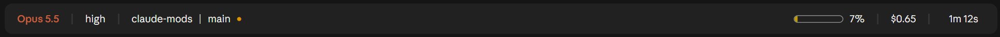

# claude-mods

A plugin marketplace of mods for [Claude Code](https://code.claude.com): live UI
plugins built on function hooks.

## Plugins

### desktop-statusline

A status bar above the prompt in the Claude desktop app's Code tab. It mirrors
the figures a terminal status line shows, drawn in the app's own theme colours:



- **Model** in the Claude accent, with the session's reasoning **effort** beside it,
  coloured from quiet (low) to warning and error tones (x-high, max).
- **Folder** and **git branch**, with a dot when the working copy has uncommitted changes.
- **Context meter**: a hollow rounded rectangle that fills as the context window does.
- **Cost** so far and **elapsed** session time. Seconds are dropped past an hour.

It draws on the desktop surface only. In the terminal it stays out of the way,
so a `statusLine` command in your settings keeps working there.

## Install in the Claude desktop app

Everything happens inside the app. No terminal needed.

**1. Open the plugin settings.** In the Claude desktop app, open **Settings**
and choose **Plugins** in the sidebar, under *Customize*.

**2. Add this marketplace.** Click the **Add** button at the top right, then
**Add marketplace**, then **Add from a repository**. Paste the repository URL:

```
https://github.com/jiroamato/claude-mods
```

Press **Sync**. The app fetches the catalogue and **claude-mods** joins your
marketplaces.

**3. Install the plugin.** **Desktop statusline** by Jiro Amato now appears in
the list. Click its **Add** button and pick a scope:

- **Install for me** puts it in `~/.claude/`, so the band is on in every
  project on this machine. This is the one to choose for a status bar.
- **Install for project (shared)** or **(personal)** limits it to the current
  project instead.

**4. Start a new session.** Open a fresh Code session and the band appears
above the prompt. Running sessions keep what they had until they end.

**Later.** Enable, disable or remove it from the same **Plugins** page, through
the menu at the end of its row. Marketplaces are managed under **Add >
Manage marketplaces**, and new versions published here arrive through a sync.

<details>
<summary>Prefer the terminal?</summary>

The terminal and the desktop app share one plugin configuration, so these two
commands give the same result:

```bash
claude plugin marketplace add jiroamato/claude-mods
```

```bash
claude plugin install desktop-statusline@claude-mods
```

</details>

## Develop

Function hooks are an early-access API: the surface may change between Claude
Code releases, and the plugin is written against the version named in each
release's notes. Each plugin folder is self-contained:

```
desktop-statusline/
  .claude-plugin/plugin.json   manifest
  hooks/hooks.json             names the hooks module
  hooks/register.tsx           the mod: hooks, state and the band's tree
  types/index.d.ts             its state contract
  tests/                       run with `claude plugin test`
```

Validate, test and type-check a plugin from its folder:

```bash
claude plugin validate --strict desktop-statusline
```

```bash
claude plugin test desktop-statusline
```

Loading it in a session lays the engine's typings beside the manifest, after
which `tsc -p desktop-statusline` type-checks it. Those generated files are
ignored by git.

To hack on it live, point a session at the folder: `claude --plugin-dir
./desktop-statusline`, or set `CLAUDE_CODE_PLUGIN_DIRS` in the `env` block of
`~/.claude/settings.json`. Saving a file reloads the mod in that session.

## License

MIT
